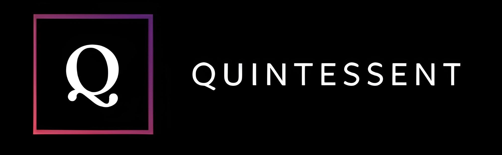

# TODO

---

- [ ] Change logo.ico: 
- [ ] Change logo.jpg: 
- [ ] Change splash_screen.jpg: 
- [ ] Add all project dependencies to pyproject.toml
- [ ] Install all project dependencies w/ uv
- [ ] Create uv.lock file
- [ ] Update code from PyQt6 to PyQt6
- [ ] Test run application
- [ ] Identify any broken features, and add them to todo.md
- [ ] Fix any broken features